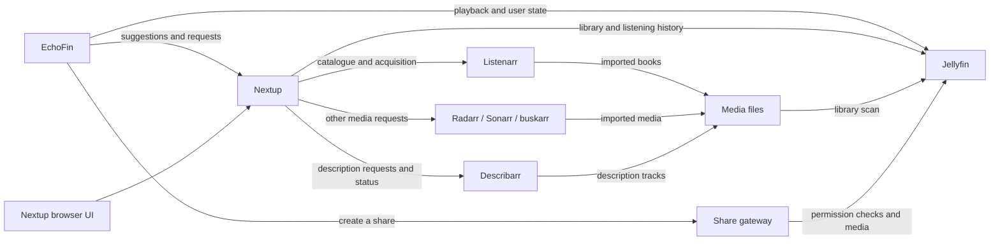

# Service responsibilities

Nextup owns recommendations for a person and that person's requests. Listenarr
owns acquiring an audiobook. Forking Listenarr makes changes possible; it does
not give it the listening history, ratings, dismissals, or complete library
needed to choose what a Jellyfin user should read next.

| Component | Responsibility | Authoritative state |
| --- | --- | --- |
| EchoFin | Accessible browsing, playback, downloads, offline reconciliation | Device state and pending offline changes |
| Jellyfin audiobook fork | Library identity and metadata, multipart books, permissions, playback state, ratings, streaming | What each user can access and has played |
| Nextup | Recommendations across media; user requests, allowances, shared demand and cancellation | User preferences, dismissals, request intent |
| Listenarr | Book catalogue search, edition resolution, acquisition, quality and import | Its managed books and acquisition jobs |
| Sonarr / Radarr / buskarr | Acquisition for their respective media | Their managed items and jobs |
| podgrab | Subscribing to a podcast feed and downloading its episodes | Its subscriptions and downloads |
| Describarr | Finding, aligning and publishing audio description | Description jobs and outcomes |
| Share gateway | Expiring links for selected media | Share grants, expiration and download limits |

The request ledger, acquisition queue, and Jellyfin library answer different
questions. A request being accepted is not evidence that a file is present;
a Listenarr library row is not evidence that somebody has listened to the book.

## Recommendations and catalogue services

Owned-book suggestions and their Jellyfin reading list require a books library.
They do not require Listenarr. Listenarr adds catalogue search, acquisition,
queue suppression and resolution of missing Audible identifiers. Its absence
must not hide the owned shelf, advertise working acquisition, or write a
negative edition lookup into the cache.

A configured catalogue can also be unavailable. Search reports that as an
outage, while recommendation building keeps the locally ranked shelf. A missing
edition or an empty similarity list may only be cached after every configured
marketplace has answered; a failure is not evidence of absence. Confirmed
edition identity survives a separate failure to fetch similar books.
After a catalogue failure, the rest of that shelf build skips further catalogue
calls. The next build can retry immediately; one user's failure does not disable
catalogue access for other users or interactive searches.

Book-specific ranking stays in `app/books/`; movie and television ranking stays
in `app/recommendations.py`. There is no need to force their different series
rules, metadata and similarity sources into one ranker. Shared authentication,
request accounting and presentation belong in Nextup.

Provider metadata is shareable; a user's taste is not. If catalogue lookups are
consolidated further in Listenarr, keep the local recommendation path usable
without it. A catalogue-only "similar books" endpoint would fit Listenarr;
per-user ranking and reading lists would still belong here.

## Nextread and Companion

The homelab cutover on 2026-09-05 merged Nextread into Nextup. There is one
running service and one database for these features. The old Nextread and
Companion repositories describe historical deployments.

`/nextread/api/v1` is still an active interface inside Nextup. Current EchoFin
uses it for book shelves, summaries and dismissals; protocol 2 in the unified
API adds book search and requests but does not yet replace all those routes.
Do not remove the prefix or old-host routing until replacement endpoints exist
and the clients that use them have migrated. A legacy address is not evidence
that another container needs to be started.

## Boundaries that still need work

* `app/books/stamp.py` repairs Jellyfin publication dates after requests arrive.
  This is metadata maintenance. The durable fix belongs in import/provider
  handling, covering books obtained through every route. Keep this repair until
  its replacement preserves edition matching, locked fields and existing dates.
* Deletion cleanup currently starts with EchoFin reporting a deletion to
  Nextup. To make the policy work for all clients, feed explicit deletion intent
  into a durable server workflow, with retries and the existing shared-demand
  guards. A temporarily inaccessible file must never be treated as deliberate
  deletion. The existing authenticated endpoint can remain an adapter.
* A second request portal such as Jellyseerr has its own request ledger and
  limits even when it targets the same Radarr and Sonarr. Either designate one
  policy owner and integrate the other portal, or document the distinct limits;
  sharing an acquisition backend does not synchronize user allowances.

These are changes to ownership and contracts. Renaming modules or moving all
book code into the Listenarr fork would not resolve them.
